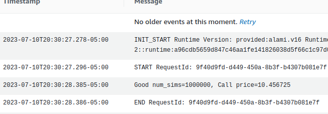

# A simple C++ Monte Carlo simulation calculator on AWS Lambda

Calculate the value of a European vanilla call option in C++ using Monte Carlo simulation.
Deploy the calculator to AWS Lambda.
Invoke the calculator with a REST call.
The number of simulations, `num_sims`, can be overriden with a query parameter.
All other parameters are hard coded.


### Prerequisites
1. aws account
2. aws cli
3. CMake (version 3.9 or later)
4. git
5. Make
6. zip
7. libcurl4-openssl-dev libssl-dev uuid-dev zlib1g-dev libpulse-dev libcurlpp-dev libcrypto++-dev


## Build the C++ AWS SDK
Run the following commands to build the C++ AWS SDK 
```bash
$ git clone https://github.com/aws/aws-sdk-cpp.git
$ cd aws-sdk-cpp
$ mkdir build
$ cd build
$ cmake .. -DBUILD_ONLY="core" -DCMAKE_BUILD_TYPE=Release -DBUILD_SHARED_LIBS=OFF -DCUSTOM_MEMORY_MANAGEMENT=OFF -DCMAKE_INSTALL_PREFIX=~/lambda-install
$ make
$ make install
```

## Build a custom C++ lambda runtime
Run the following commands to build the C++ lambda custom runtime:
```bash
$ git clone https://github.com/press0/aws-lambda-cpp.git
$ cd aws-lambda-cpp
$ mkdir build
$ cd build
$ cmake .. -DCMAKE_BUILD_TYPE=Release -DCMAKE_INSTALL_PREFIX=~/lambda-install
$ make && make install
```

## Build the C++ lambda function
Run the following commands to build the C++ lambda function

```bash
$ cd ../examples/monte-carlo-calculator/
$ mkdir build
$ cd build
$ cmake .. -DCMAKE_BUILD_TYPE=Release  -DBUILD_SHARED_LIBS=OFF -DCMAKE_PREFIX_PATH=~/lambda-install
$ make aws-lambda-package-demo
```

Verify that a file named `demo.zip` was created. 

## Create the AWS IAM resources

```
$ cat ../trust-policy.json
{
 "Version": "2012-10-17",
  "Statement": [
    {
      "Effect": "Allow",
      "Principal": {
        "Service": ["lambda.amazonaws.com"]
      },
      "Action": "sts:AssumeRole"
    }
  ]
}

```

Create the IAM role:
```bash
$ aws iam create-role --role-name lambda-demo --assume-role-policy-document file://../trust-policy.json
```
Note the role Arn returned from the command: <API-ENDPOINT-ARN> 

Attach the following policy to allow Lambda to write logs in CloudWatch:
```bash
$ aws iam attach-role-policy --role-name lambda-demo --policy-arn arn:aws:iam::aws:policy/service-role/AWSLambdaBasicExecutionRole
```

## Create the AWS Lambda function
```bash
$ aws lambda create-function --function-name demo --role <API-ENDPOINT-ARN> --runtime provided --timeout 15 --memory-size 128 --handler demo --zip-file fileb://demo.zip

# response
{
    "FunctionName": "demo",
    "FunctionArn": "arn:aws:lambda:xxxxxxxxxxxxxxxxxxxxxxxxxxxxxxxxxx",
    "Runtime": "provided",
    "Role": "arn:aws:iam::167712817792:role/lambda-demo",
    "Handler": "demo",
    "CodeSize": 13765485,
    "Description": "",
    "Timeout": 15,
    "MemorySize": 128,
    "LastModified": "2023-07-10T20:52:40.434+0000",
    "CodeSha256": "mN/9DIPLA4ZpftWVBTHaTdZsO3nXk+AVHjfyNRoznWg=",
    "Version": "$LATEST",
    "TracingConfig": {
        "Mode": "PassThrough"
    },
    "RevisionId": "683bf451-3fb4-4a5e-bdf1-0d5fa1158c41",
    "State": "Pending",
    "StateReason": "The function is being created.",
    "StateReasonCode": "Creating",
    "PackageType": "Zip"
}
```

## Update the function, as needed
```bash
aws lambda update-function-code --function-name demo --zip-file fileb://demo.zip


```

## Test the function with the aws cli
```bash
$ aws lambda invoke --function-name demo --cli-binary-format raw-in-base64-out --payload '{}' out.txt

$ cat out.txt
{
  "message":"OK num_sims=100000, Call price=10.423098 "
}

```

## Add a Lambda endpoint 
TODO: use the aws cli or the aws console

`<API-ENDPOINT-ARN>`

## Test the function with curl

```bash
curl 'https://<API-ENDPOINT-ARN>.lambda-url.us-west-2.on.aws?num_sims=1000000' 
# response
{
"message": "OK num_sims=1000000, Call price=10.459100 "
}
```

## check performance in CloudWatch

one tenth of a second


## Test the function at scale
todo


## Delete the function
```bash
aws lambda delete-function     --function-name demo
```

## Delete the role
todo:  detach policies first
```bash
aws iam delete-role --role-name lambda-demo
```

## Citations
1. https://www.quantstart.com/articles/European-vanilla-option-pricing-with-C-via-Monte-Carlo-methods/

